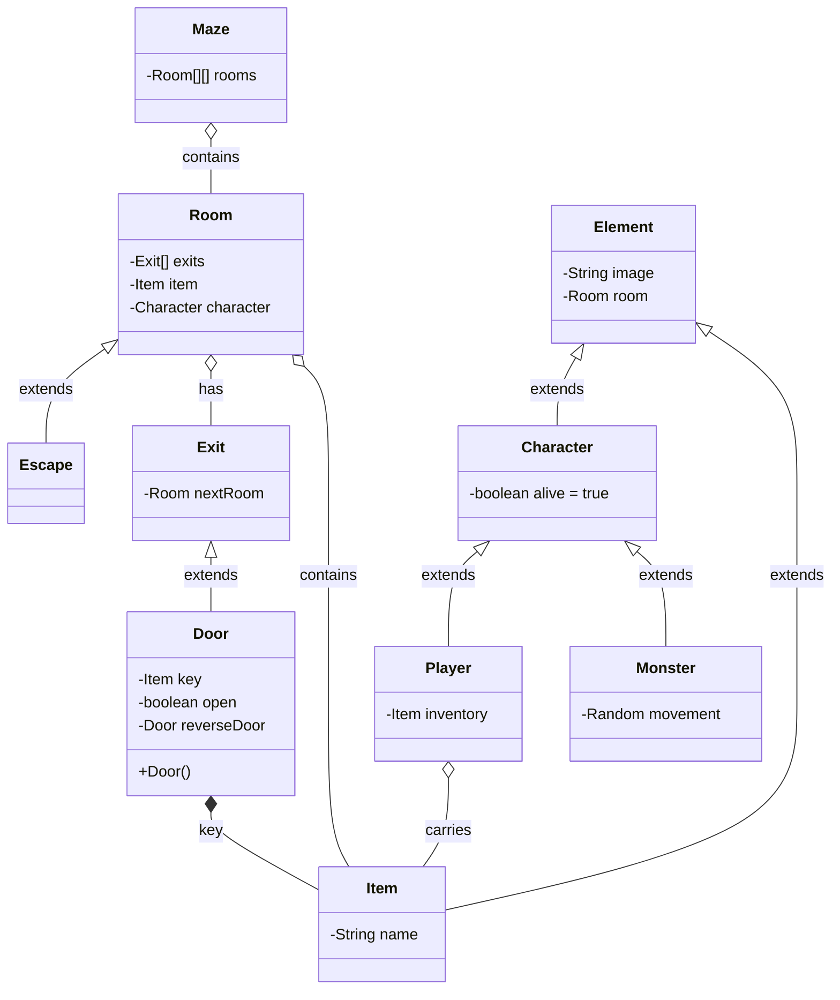

## About Maze application
> Using this small program to explain about the OOP.
<p align="center">
  
</p>

> To run the program, please read the follow:
#### Requirements
* Java 1.17

#### Installation
```
git clone
```

#### Run 
```
run file main.Main.java
```
#### Class Diagram

